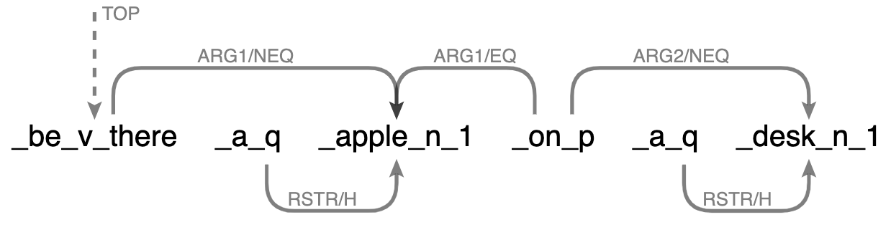

Knowledge graphs organize knowledge as graphs. They have contributed to a domain of research in recent data science, machine learning, and natural language processing. This blog post presents some thoughts that I have on it, and in particular, the challenges of using them.

## 1. Why in the first place store knowledge

The mentions of knowledge graphs can be traced back to the early days of the development of the Semantic Web, whose motivation was to organize web data in a machine-readable way that allows them to be shared and reused across application.
In a broad sense, data sources of knowledge graphs are not confined to the domain of web data, but data of any kind.

For now, let's first forget about whether to structure knowledge as graphs and focus on knowledge representations.
A knowledge representation can be as simple as a attribute-value pair, e.g., \\(  \texttt{colour}: \texttt{red} \\) as some knowledge about \\( \texttt{apple} \\).
Explicit representations of knowledge facilitate integrations of knowledge.
For example, knowing that sometimes apples have the attribute-value \\( \texttt{colour}: \texttt{green} \\) can readily give us \\(\texttt{colour}: \texttt{red} \lor \texttt{green} \\).

I argue that knowledge representations should not be stuided on their own, and if we wish to evaluate the quality of such representations, apart from them being faithful to the knowledge, we have to assess with a top-down goal that we are trying to achieve via the representations.
For instance, if all one wants to know is the steps of growing an apple, such a representation presented above is largely irrelevant.
Moreover, building representations of knowledge is only meaningful if they will be used.
For instance, even if one build a representation \\(  colour: \texttt{RGB}(229, 29, 0) \\), what is the point if no one really cares about or uses the exact RGB values of \\( \texttt{red} \\)?
I suggest that knowledge representations are meant to be consumed in the downstream—the representations themselves are mostly irrelevant by-products.

## 2. What is Knowledge Anyway
What is knowledge, and how do we represent it?
Knowledge, in its general sense, can really be anything informative about things in this world—from something as simple as "there is an apple on a desk", or as complex as "a particle of charge \\(q\\) moving with a velocity \\(v\\) in an electric field \\(E\\) and a magnetic field \\(B\\) experiences a force (in SI units) of \\( F = q ( E + v \times B ) \\) (such a sentence is not complex to be said, but understood).
Nevertheless, it is not straightforward even to represent the first sentence.
How do we represent the knowledge about "There is an apple on a desk" in a formal way?

Truth-conditional semantics provide a way to formalize meanings that allows _compositions_ of them and _logical_ comprehension ([here](https://www.ucl.ac.uk/~ucjtudo/teaching/AST/LectureNotes/LectureNotes-Week1.pdf) for a brief introduction).
In this example, we may represent this piece of knowledge as a logical form \\( P_1 \\):

$$ P_1 = \exists x, y: \texttt{apple}(x) \land desk(y) \land on(x, y) \textrm{.}$$

Knowing such is equivalent to identifying the truth conditions of the logical form, that is, figuring out the situations where \\( \exists x, y: \texttt{apple}(x) \land \texttt{desk}(y) \land \texttt{on}(x, y) \\) is true (or false).
If we further know that all apples are either red or green, i.e.,

$$ P_2 = \forall x: \texttt{apple}(x) \implies \texttt{red}(x) \lor \texttt{green}(x) \textrm{,} $$

we can _compose_ and _deduce_:

$$ Q_1 = \exists x, y: \texttt{red}(x) \lor \texttt{green}(x) \land desk(y) \land on(x, y) \textrm{,} $$

which is that "there is something red or green on a desk".

Now, with "All green apples are sour", i.e.,

$$ P_3 = \forall x: \texttt{apple}(x) \land \texttt{green}(x) \implies \texttt{sour}(x) \textrm{,} $$

we have:

$$ Q_2 = \exists x, y: \texttt{red}(x) \lor ( \texttt{green}(x) \land \texttt{sour}(x) ) \land desk(y) \land on(x, y) \textrm{.} $$

Of course, truth-conditional semantics is not the only framework one needs to account for all semantic phenomena.
However, it does provide a nice characterization of literal meanings where where our intutions about the situations described are particularly clearcut, which is also desired when we talk about knowledge.

## 3. Why (Not) as Graphs

### 3.1 This is Hardly a Graph

A graph consists of a set of nodes which are atomic, and any two nodes can be connected with an edge.
To my knowledge (no pun intended), people mostly work with knowledge graphs that are labelled and directed, i.e., nodes and edges can be labelled and edges are directed.
Many considers graphs to be natural structures that model relations (as edges) between concepts (as nodes).
However, how would one approach to represent "there is an apple on a desk" with a graph?
We may get away with:

$$ \texttt{apple}_{\# \ge 1} \xrightarrow{\texttt{on}} \texttt{desk}_{\# \ge 1} \textrm{.} $$

What about "no apples are under a desk"? Here are my best attempts:

$$ \texttt{apple}_{\# = 0} \xrightarrow{\texttt{under}} \texttt{desk}_{\# \ge 1} $$

or

$$ \texttt{apple}_{\forall} \xrightarrow{\neg \texttt{under}} \texttt{desk}_{\# \ge 1} \textrm{.} $$

Proceeding to compose these with other knowledge would be problematic since graphs do not naturally provide the tools for modelling some aspects of semantics.
For example, integrating "All green apples are sour" to this, my best (and definitely a bad!) attempt would be:

$$ \texttt{sour}  \xleftarrow{\cap \texttt{green}} \texttt{apple} \xrightarrow{\forall \neg \texttt{under}} \texttt{desk}_{\# \ge 1} $$

On the other hand, as seen in the above, a truth-conditional representation provides the instruments for handling set operations and scopes and also comes with nice logical properties.

#### A Side Note
Another way of using graphs as the knowledge representation could be via semantic graphs, e.g., Dependency Minimal Recursion Semantics (DMRS) graphs, which express Minimal Recursion Semantics (MRS; [here](https://www.cl.cam.ac.uk/~aac10/papers/mrs.pdf) for an exposition) graphically:

{: .align-center style="width: 75%;"}

In short, MRS is a semantic representation framework that underspecifies morphosyntactically identical ambguities, and an MRS structure can be derived from a parse of English sentence by the [English Resource Grammar](https://delph-in.github.io/docs/erg/ErgTop/). While this approach is linguistically principled, it could be too ambiguous, or if not, too heavy-duty to adopt DMRS as knowledge representations.

### 3.2 This is a Graph
What qualifies to be a graph? Let's consider the following relational table:

| Id | Brand  | Product  | Colour |
|----|--------|----------|--------|
| a  | Nike   | Shorts   | White  |
| b  | Nike   | Trainers | White  |
| c  | Adidas | Trainers | White  |
| d  | Adidas | Trainers | Black  |

While it is not immediately clear how this can be a graph, here is how one could transform it into one:

{: .align-center style="width: 90%;"}
<!-- <object data="../assets/blog_files/kg/kg.drawio.pdf" width="1000" height="1000" type='application/pdf'></object> -->

The transformation does not have to be unique. There are many ways of transforming a relational table into a graph.
This example transformation here is a pretty neat one considering that each unique value in the table corresponds to one node, and each column name is mapped to an edge label (\\( \texttt{hasBrand} \\), \\( \texttt{hasProduct} \\), \\( \texttt{colourIs} \\)).
This is not to say that tables should be transformed to graphs, and indeed we should not because graph strcutures do not express relational models well and we gain nothing from the transformation.
Rather, I hope this example could make you ponder the motivation of graphing knowledge.

<!-- A (simple) labelled directed graph is nothing more than a set of triples in the form
\\( ( \textrm{[}\texttt{source}\textrm{]}, \textrm{[}\texttt{target}\textrm{]}, \textrm{[}\texttt{edge label}\textrm{]} ) \\). -->

### 3.3 If You Still Like Graphs
What about hypergraphs?
A hypergraph is where nodes are atomic but each edge can connect to one, two, or more than two nodes.
These edges are called hyperedges.
In this sense, graphs are just mathematical objects subclassed to hypergraphs where the number of nodes each edge connects to is exactly two.
Compared to regular graphs, it can be more intricate to understand or visualize hypergraphs.
Nevertheless, these should not be reasons that stop us from using them–the goodness of some knowledge representation should be evaluated not intrinsically but extrinsically for some particular downstream needs.

Hypergraphs are more expressive than regular graphs as we can now represent multi-way relations, e.g., the fire triangle, or tetrahedron:

 

Now, we may represent the elements of the fire triangle and tetrahedron as nodes: 

$$ n_1 = \texttt{oxygen}, n_2 = \texttt{heat}, n_3 = \texttt{fuel}, n_4 = \texttt{chain_reaction}  $$

and the relations as hyperedges:

$$ \texttt{fire_triangle} = (n_1, n_2, n_3) $$

$$ \texttt{fire_tetrahedron} = (n_1, n_2, n_3, n_4)  $$

In truth-conditional representations, multi-way relations can also be modelled by predicates of different arities, e.g., roughly as:

$$ \texttt{fire_triangle}(x_1, x_2, x_3) $$

$$ \texttt{fire_tetrahedron}(x_1, x_2, x_3, x_4) $$

where $$ \texttt{oxygen}, \texttt{heat}, \texttt{fuel}, \texttt{chain_reaction} $$ are true of $$ x_1, x_2, x_3, x_4 $$ respectively.

While you may not like it, we can actually transform the above relational table into this hypergraph, where each node is a value in the table, the 3-edges \\( \texttt{a} \\), \\( \texttt{b} \\), \\( \texttt{c} \\), and \\( \texttt{d} \\) correspond to the four records:

{: .align-center style="width: 40%;"}

Now, when you query a relational database, consider putting it as "multi-hop retrieval over a knowledge hypergraph"!

## 4. Summary
Regular graphs are not some structure specifically tailored for representing knowledge.
We are so used to thinking of graphs with concepts as nodes and relations as edges but in many times knowledge does not structure itself that way.
On the other hand, we are also used to omit representations that are actually graphs in disguise!

In addition to the above-discussed challenges of graphing knowledge, here are some more. If a node or edge is labelled by a word, how do we deal with (1) polysemy, e.g., a school as an institution as in "The school is facing financial problems", or as a physical building as in "The school is undergoing renovation", and (2) multi-word expressions? (3) How do we represent spacial-temporal-specific knowledge? And of course we must concern with (4) how do we automate the construction of such knowledge graphs?

Before coming to a specific solutions of knowledge representation, we should reflect on, first, whether such representation is needed at all.
If needed, considering the different data structures that allow explciit representations of knowledge, where one may be better or worse than the other in terms of different perspectives, where these perspectives after all should be weighted by the top-down goal we aim to achieve via these representations.
